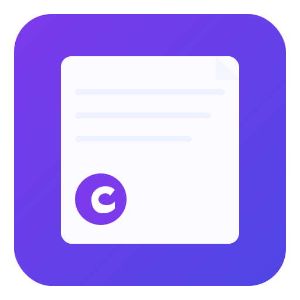

# Capnote — Minimal Desktop Notepad & Journal

Capnote is a lightweight, modern desktop app for quick notes and journaling. It focuses on a clean writing experience, local storage, and fast editing tools — optimized for daily use.



## Features

- **Rich editor:** bold, italic, underline, alignment, lists and checklists.
- **Formatting controls:** font family & size, text/background color, copy/duplicate notes.
- **Organization:** tags, folders, favorites and quick search/filtering.
- **Security:** lock notes with a password and temporarily unlock for viewing.
- **Auto-save & status:** automatic saving with save-state tracking and undo support.
- **Statistics:** word/character counts and estimated reading time.
- **Themes & shortcuts:** dark/light theme and keyboard shortcuts (Ctrl/Cmd+N, Ctrl/Cmd+S, Esc, etc.).

## How to Use

Run from source (developer):

```powershell
npm install
npm run dev
```

Start normally:

```powershell
npm start
```

Packaging (example):

```powershell
npm run build      # all platforms (uses electron-builder)
npm run build-win  # Windows
```

No cloud sync is enabled by default — data is stored locally. Use the app's export/import functions to move notes between machines.

## License

This project is licensed under the MIT License — see `LICENSE` for details.

